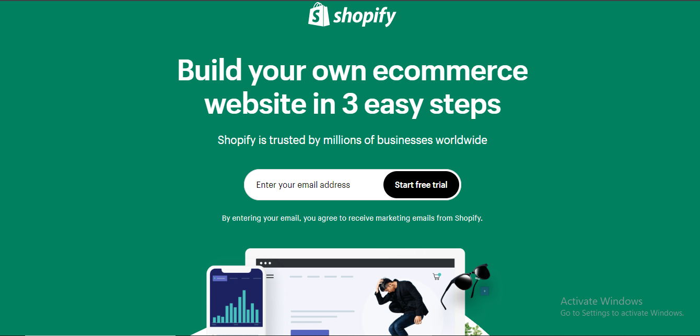

# Stateless
stateless task

1. Statelessness
Statelessness refers to the idea that each request made to the server is independent, and the server does not retain any information from previous requests.
In a stateless system, any necessary information is sent along with each request, such as an authentication token.
For example, when you visit Shopify's homepage and enter your email to start a free trial, the request sent to the server to process that email is independent of any other previous or future requests. The server processes this request without needing to keep any "memory" of who you are beyond what is provided in the request itself.
2. Authentication
Authentication is the process of verifying the identity of a user. For Shopify, this would involve users logging in with their credentials (e.g., email and password) to access their account.
Once logged in, the user may receive a session token or an authentication token (like a JWT - JSON Web Token) that the browser will send with each request to identify the user.
For Shopify's free trial, after entering an email, the user would likely go through a sign-up process where they create an account. During this process, authentication verifies that the user is legitimate and grants them access to their account.
3. Authorization
Authorization defines what actions a user is allowed to perform or what resources they can access.
After logging in (authenticated), a Shopify user may have access to different areas of the website based on their role (e.g., store owner, customer, admin).
For example, the store owner would have access to create products, view sales reports, or configure payment settings, while a regular customer might only have access to view and purchase products.
Shopify’s authorization system ensures that each user can only perform actions that they are permitted to do based on their role and permissions.
